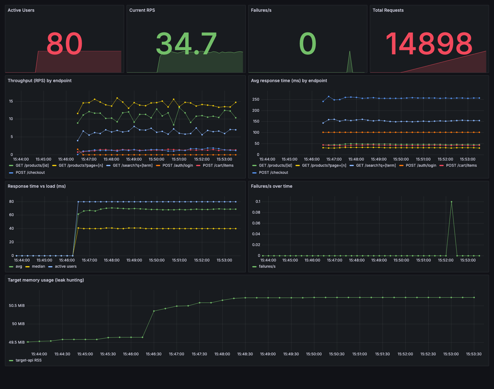
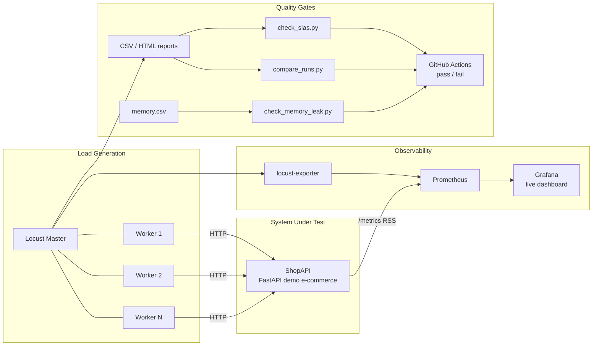
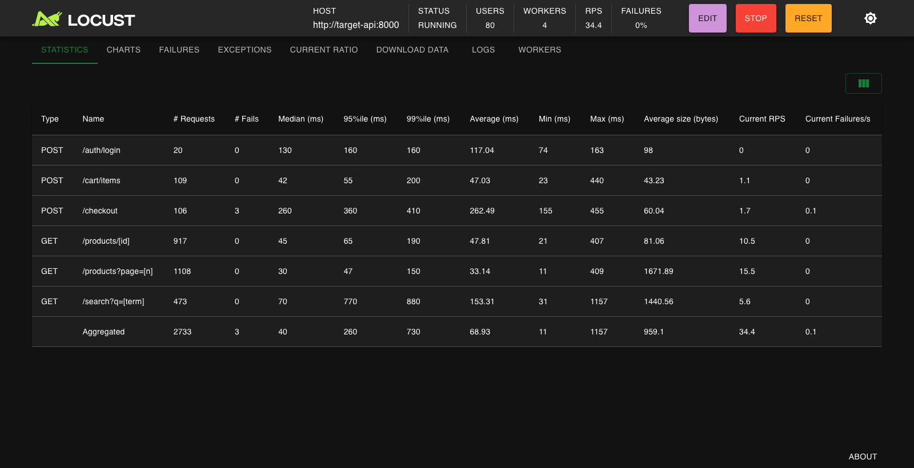
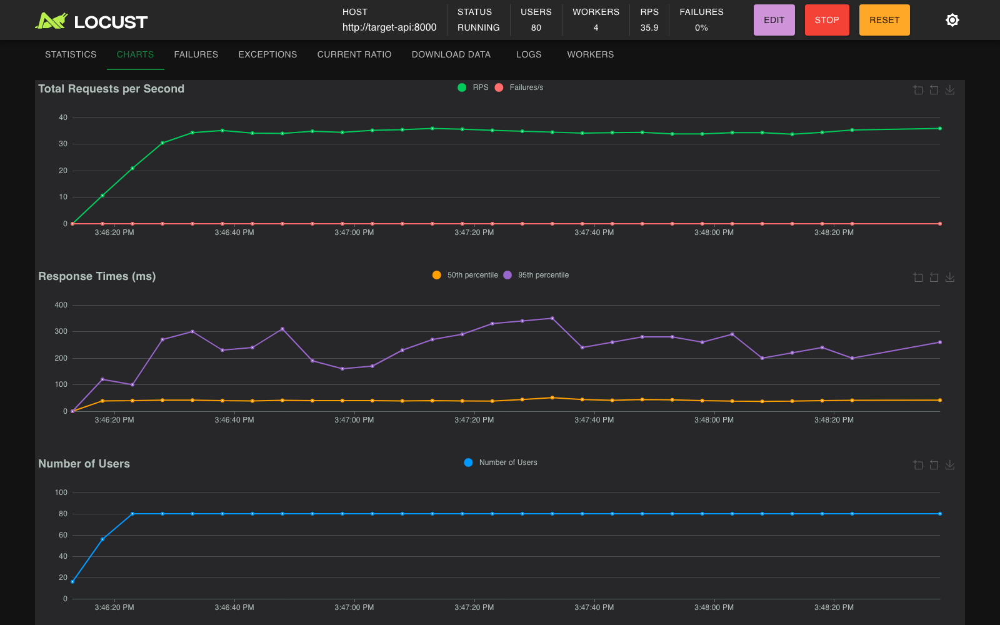

# ⚡ Locust Performance Lab

[](.github/workflows/load-test.yml)
[](https://locust.io)
[](docker-compose.yml)
[](LICENSE)

**Performance testing as code** — a complete, self-contained load testing framework built with
[Locust](https://locust.io). Everything runs with one command: the system under test, distributed
load generation, live Grafana monitoring, automated memory-leak hunting, run-over-run regression
detection, and an SLA gate that fails the CI build when latency budgets are breached.

> Built by a performance engineer with a JMeter background, to demonstrate the code-first,
> CI-native approach to load testing. See [Coming from JMeter?](#-coming-from-jmeter) below.



---

## Table of contents

- [Why this project](#-why-this-project)
- [Architecture](#-architecture)
- [Quickstart](#-quickstart)
- [Test scenarios](#-test-scenarios)
- [Workload model](#-workload-model)
- [Load shapes](#-load-shapes)
- [SLA gate](#-sla-gate--performance-tests-that-can-fail-the-build)
- [Regression detection](#-regression-detection)
- [Memory leak detection](#-memory-leak-detection)
- [Live monitoring](#-live-monitoring)
- [Scalability](#-scalability)
- [Testing your own system](#-testing-your-own-system)
- [CI/CD pipeline](#-cicd-pipeline)
- [Interpreting the results](#-interpreting-the-results)
- [Design decisions](#-design-decisions)
- [Coming from JMeter?](#-coming-from-jmeter)
- [Troubleshooting](#-troubleshooting)
- [Roadmap](#-roadmap)

## 🎯 Why this project

Most load testing happens too late, runs manually, and produces a PDF nobody reads. This repo
demonstrates the opposite workflow — the one modern engineering teams actually want:

1. **Tests live next to the code** and are reviewed like code.
2. **Every pull request gets a load test**, and the build fails if performance regresses.
3. **Pass/fail is decided by explicit SLAs**, not by someone eyeballing a graph.
4. **Soak-class problems (memory leaks) are detected automatically**, not discovered in production.
5. **Results are observable live** (Grafana), reported as artifacts (HTML/CSV), and comparable
   across runs.

The repo is fully self-contained: it ships its own system under test, so anyone can clone it and
see every feature working in minutes — then point it at a real system by changing one URL.

## 🏗 Architecture



| Component | Role |
|---|---|
| **Locust master + workers** | Distributed load generation; workers scale horizontally (`WORKERS=N`) |
| **ShopAPI** (`target_app/`) | Demo e-commerce API with *intentionally realistic* performance traits |
| **Prometheus + Grafana** | Live view of RPS, latency percentiles, failures, and target memory |
| **Quality-gate scripts** (`scripts/`) | Turn raw results into CI exit codes: SLAs, regressions, memory leaks |
| **GitHub Actions** | Runs the whole pipeline on every PR and nightly |

ShopAPI is deliberately not a "hello world": its search endpoint has ~15% simulated cache misses,
checkout is throttled by a small payment-gateway connection pool (latency degrades under
concurrency — a textbook queueing bottleneck), ~1% of checkouts fail with a simulated gateway
timeout, and an optional switch makes it leak memory on demand. Every test produces results worth
analyzing — not just flat green lines.

## 🚀 Quickstart

Prerequisites: Docker (with Compose v2), Python 3.9+, `make`. Python dependencies are only needed
for the analysis scripts: `pip install -r requirements.txt`.

```bash
# Interactive mode: Locust web UI at http://localhost:8089
make up

# Everything + live monitoring: Grafana at http://localhost:3000
make monitoring

# Tear down
make down
```

In the web UI, pick the number of users and spawn rate, start the test, and watch the charts —
or watch the same run in Grafana with per-endpoint breakdowns and target memory.



## 🧪 Test scenarios

Each headless scenario produces CSV + HTML reports in `reports/` and runs the SLA gate
automatically:

| Command | Scenario | Profile | When to use |
|---|---|---|---|
| `make smoke` | Sanity check | 10 users, 1 min | After every change to the test plan |
| `make baseline` | Reference measurement | 50 users, 5 min | Before tuning; feeds regression checks |
| `make stress` | Find the saturation point | stepped ramp 10 → 150 users | Capacity planning |
| `make spike` | Resilience to sudden traffic | 20 → **200** → 20 users | Flash sales, TV moments, failover |
| `make soak` | Degradation over time | 60 users, 30+ min (`SOAK_MINUTES`) | Leaks, connection exhaustion, drift |
| `make leak-test` | Automated memory-leak hunt | constant load + memory trend gate | Part of every soak |
| `make compare` | Run-over-run regression diff | any two recorded runs | After code or tuning changes |

Every run also writes an interactive HTML report (`reports/<scenario>.html`) with charts of RPS,
latency percentiles and failures over time — the artifact you attach to a ticket.



## 👥 Workload model

Traffic is modeled on real e-commerce behavior, not uniform request spam:

- **`BrowsingUser` (75%)** — browses the catalog, opens product pages, searches. Weighted tasks
  (`@task(4)` browse, `@task(3)` product page, `@task(2)` search) with think time
  (`wait_time = between(1, 3)`).
- **`PurchasingUser` (25%)** — authenticates once, then executes the full conversion funnel as a
  `SequentialTaskSet`: browse → product page → add to cart → checkout. Steps always run in order,
  like a real buyer.

Details that matter at scale:

- **Functional validation under load** — `catch_response` marks a `200` from checkout *without an
  `order_id`* as a failure, and a product payload missing its `price` field as a failure. Wrong
  answers delivered quickly are still wrong.
- **URL grouping** — dynamic URLs are grouped (`name="/products/[id]"`), so statistics aggregate
  per endpoint instead of producing 200 one-sample rows.
- **Outlier visibility** — an `events.request` listener logs every individual request slower than
  1s (`SLOW_REQUEST_MS`), so the tail is visible during the run, not only in the final percentiles.
- **Trace correlation** — authenticated users send an `X-Session-ID` header, so load test traffic
  can be tied back to the target system's logs and traces during root-cause analysis.
- **`FastHttpUser`** — both classes use the geventhttpclient-based client, which sustains roughly
  an order of magnitude more RPS per worker than the default requests-based client.

## 📈 Load shapes

`-u`/`-r`/`-t` flags cover constant load. Real questions — *where does it saturate? does it
survive a spike? does it degrade over hours?* — need load that changes over time. Profiles are
implemented as [`LoadTestShape`](locustfiles/ecommerce.py) classes and selected with one
environment variable, so one test plan serves every profile:

```python
class SpikeShape(LoadTestShape):
    """Steady 20-user baseline with a sudden 10x spike (e.g. flash sale)."""

    def tick(self):
        run_time = self.get_run_time()
        if run_time < 120:
            return (20, 5)
        if run_time < 180:
            return (200, 50)   # the spike
        if run_time < 360:
            return (20, 50)    # recovery — watch how fast p95 settles
        return None
```

| `LOAD_SHAPE` | Profile |
|---|---|
| `stages` | 10 → 50 → 100 → 150 users in steps, then ramp-down — saturation hunting |
| `spike` | 20 users baseline, sudden jump to 200, back to 20 — resilience and recovery |
| `soak` | ramp once, hold for `SOAK_MINUTES` — slow failure modes |

## ✅ SLA gate — performance tests that can fail the build

Budgets live in [`config/slas.yml`](config/slas.yml) — global plus per-endpoint overrides:

```yaml
global:
  p95_ms: 800          # 95th percentile latency budget
  error_rate_pct: 2.0
  min_rps: 3           # sanity floor — the test must have generated real load
endpoints:
  "POST /checkout":
    p95_ms: 1500       # payment gateway call is allowed a higher budget
  "GET /search?q=[term]":
    p95_ms: 1000       # known cache-miss penalty
```

[`scripts/check_slas.py`](scripts/check_slas.py) parses Locust's CSV output, prints a verdict
table, and **exits non-zero on any breach**. Real output from a smoke run of this repo:

| Scope | Metric | Actual | Limit | Verdict |
|---|---|---|---|---|
| POST /checkout | p95 latency | 320 ms | <= 1500 ms | ✅ PASS |
| GET /search?q=[term] | p95 latency | 780 ms | <= 1000 ms | ✅ PASS |
| Aggregated | p95 latency | 160 ms | <= 800 ms | ✅ PASS |
| Aggregated | error rate | 0.00 % | <= 2.0 % | ✅ PASS |
| Aggregated | throughput | 4.4 rps | >= 3 rps | ✅ PASS |

Why a script instead of a dashboard? Because a dashboard needs a human, and a human is exactly
what a nightly pipeline doesn't have. An exit code scales.

## 📉 Regression detection

A single run tells you *where you are*; comparing runs tells you *where you're heading*.
[`scripts/compare_runs.py`](scripts/compare_runs.py) diffs two runs endpoint by endpoint and
fails when p95 grows, throughput drops, or the error rate worsens beyond a configurable tolerance
(default 15%):

```bash
make baseline                                   # record the reference run
make compare CURRENT=reports/smoke_stats.csv    # after a code/tuning change
```

```
| Endpoint           | p95 (base → now) | Δ p95   | rps (base → now) | Δ rps   | Verdict      |
|--------------------|------------------|---------|------------------|---------|--------------|
| GET /products/[id] | 67 → 72 ms       | +7.5 %  | 1.2 → 1.5        | +18.9 % | ✅ OK        |
| POST /checkout     | 340 → 320 ms     | -5.9 %  | 0.2 → 0.2        | -24.9 % | ✅ OK        |
| Aggregated         | 310 → 160 ms     | -48.4 % | 4.2 → 4.4        | +5.6 %  | ✅ OK        |
```

Combined with the nightly scheduled run in CI, this turns one-off load tests into **continuous
performance testing** — regressions surface the day they are introduced, not in production.

## 🧠 Memory leak detection

Soak tests exist to catch what a 5-minute run never will: memory that grows linearly under
constant load until the service OOMs in production. This repo automates the whole hunt:

```bash
make leak-test                  # sample memory under 10 min of constant load + analyze
make leak-test LEAK_MINUTES=60  # the real thing, alongside `make soak`
```

[`scripts/memory_monitor.py`](scripts/memory_monitor.py) samples the target container's memory
every 5s while the load runs; [`scripts/check_memory_leak.py`](scripts/check_memory_leak.py)
discards the warm-up phase (caches filling up is growth, not a leak), fits a least-squares trend
line through the rest, and **fails when the growth rate and total growth both exceed their
budgets** — two conditions, so noise from short runs can't extrapolate into a false alarm.

Don't trust a leak detector you've never seen catch a leak. ShopAPI ships with a simulated leak
(~50 KB per request, `SIMULATE_MEMORY_LEAK=true`) so the gate can be demonstrated end to end.
Real output from both runs of this repo, same load, three minutes each:

```bash
SIMULATE_MEMORY_LEAK=true make leak-test LEAK_MINUTES=3
```

| Metric | Value |
|---|---|
| analyzed window | 2.4 min (23 samples, warm-up excluded) |
| memory at window start → end | 58.2 MB → 153.7 MB |
| total growth | **+95.5 MB** (gate: > 15 MB) |
| fitted growth rate | **+2351 MB/h** (gate: > 50 MB/h) |
| verdict | ❌ **MEMORY LEAK SUSPECTED** — exit 1 |

```bash
make leak-test LEAK_MINUTES=3
```

| Metric | Value |
|---|---|
| total growth | +2.5 MB (gate: > 15 MB) |
| fitted growth rate | +59.5 MB/h — slightly over the rate gate, but extrapolated from noise |
| verdict | ✅ **STABLE** — exit 0, because *both* conditions must hold |

Two complementary vantage points are used: the gate measures **black-box** memory via
`docker stats` (works for any container, no instrumentation needed), while ShopAPI also exposes
its own RSS on a Prometheus `/metrics` endpoint — the **white-box** curve is visible live in
Grafana while the soak is still running.

## 📊 Live monitoring

`make monitoring` adds the observability stack: a Prometheus exporter scrapes the Locust master,
ShopAPI exposes its own process metrics, and a pre-provisioned Grafana dashboard
(`http://localhost:3000`, no login needed) shows:

- active users, current RPS, failures/s, total requests (top row)
- per-endpoint throughput and average response time
- p50/p95 percentiles overlaid with the user ramp — see latency react to load
- target memory usage — the leak-hunting panel

This is the same setup you'd use to watch a production load test: no waiting for the final
report, problems are visible the moment they start.

## 📐 Scalability

Load generation scales horizontally without touching the test plan:

```bash
make up WORKERS=8        # 8 Locust worker containers on this host
```

- **`FastHttpUser`** keeps per-worker overhead low — thousands of RPS per generator.
- The master/worker split is plain Docker Compose, so the same images run distributed across
  multiple hosts (point `--master-host` at the master) or on Kubernetes via a Helm chart.
- Test scenarios, SLAs, and infrastructure are decoupled (`locustfiles/`, `config/`,
  `docker-compose.yml`) — each scales or swaps independently.

## 🔌 Testing your own system

The demo API is a stand-in. To target a real system:

1. Point the host at it: `locust -f locustfiles/ecommerce.py --host https://staging.example.com`,
   or change `--host` in the `Makefile`/`docker-compose.yml`.
2. Replace the task methods in [`locustfiles/ecommerce.py`](locustfiles/ecommerce.py) with your
   endpoints — the structure (user classes, weights, funnel, validation) carries over as-is.
3. Update [`config/slas.yml`](config/slas.yml) with your latency budgets.
4. For `make leak-test`, set the container name of *your* service in the `--container` flag.

Everything else — distributed workers, shapes, gates, CI, dashboards — works unchanged.

## 🔄 CI/CD pipeline

[`.github/workflows/load-test.yml`](.github/workflows/load-test.yml) runs on three triggers:

| Trigger | Purpose |
|---|---|
| `pull_request` | Block merges that regress performance |
| `schedule` (nightly) | Continuous performance testing on the default branch |
| `workflow_dispatch` | On-demand runs with custom user count & duration |

Each run: builds and health-checks the target → runs Locust headless → executes the SLA gate
(verdict table lands in the GitHub job summary) → uploads CSV/HTML reports as artifacts. A failed
SLA is a failed check on the PR — performance becomes a merge requirement, like tests and lint.

## 🔍 Interpreting the results

A few principles this repo's design encodes, which apply to any load test:

- **Percentiles over averages.** ShopAPI's search averages ~140 ms but its p95 is ~780 ms — the
  average hides the 15% of users hitting cache misses. SLAs here are written against p95.
- **Watch latency *as a function of* load.** The Grafana percentile panel overlays the user ramp:
  if p95 climbs while RPS plateaus during `make stress`, you've found the saturation point —
  that plateau is your capacity number.
- **Errors are a latency metric too.** A system that sheds load with fast 502s looks *faster* in
  averages. The SLA gate therefore budgets error rate separately.
- **Trends beat snapshots.** A 300 ms p95 is neither good nor bad in isolation; +44% versus
  yesterday's baseline is actionable. Hence `compare_runs.py` and the nightly run.
- **Memory verdicts need both slope and magnitude.** Short windows extrapolate noise (41 MB/h
  from a 3-minute stable run); requiring absolute growth *and* rate keeps the leak gate honest.

## 🧩 Design decisions

| Decision | Rationale |
|---|---|
| Ship a demo SUT with deliberate bottlenecks | A framework demo against a perfect target proves nothing; every feature here is demonstrable against a system that actually misbehaves |
| Gates as small stdlib-ish scripts, not plugins | Exit codes compose with any CI; no plugin lock-in; reviewable in one screen |
| `LOAD_SHAPE` env var, one locustfile | One reviewed workload model reused across smoke/stress/spike/soak — profiles differ, behavior doesn't |
| Leak gate = slope **and** absolute growth | Either alone produces false alarms on short runs or misses slow leaks |
| Compose profiles for monitoring | `make up` stays light; the full observability stack is one flag away |
| `FastHttpUser` by default | Load generators should saturate the target, not themselves |

## 🔄 Coming from JMeter?

I run JMeter in production projects daily — this lab demonstrates what the code-first approach
adds:

| Concern | JMeter | Locust (this repo) |
|---|---|---|
| Test plan | XML `.jmx`, GUI-edited, hard to diff | Plain Python — reviewable in a PR |
| Complex user logic | Chained pre/post-processors | Ordinary code (`SequentialTaskSet`) |
| Load profiles | Plugins (Ultimate Thread Group) | ~15 lines of `LoadTestShape` |
| Scale-out | Manual master/slave RMI setup | `docker compose` worker replicas |
| CI integration | Possible, heavyweight | Native: pip install + exit codes |
| Pass/fail criteria | Assertions + external tooling | SLA/regression/leak gates with exit codes |

Both have their place — JMeter's protocol coverage and ecosystem are unmatched. The skill is
choosing the right tool and making either one a first-class citizen of the delivery pipeline.

## 📂 Project structure

```
├── locustfiles/ecommerce.py    # user journeys + stress/spike/soak load shapes
├── target_app/                 # ShopAPI — FastAPI system under test (Docker)
├── config/slas.yml             # latency / error-rate / throughput budgets
├── scripts/check_slas.py       # SLA gate (CI exit code + Markdown summary)
├── scripts/compare_runs.py     # run-over-run regression detection
├── scripts/memory_monitor.py   # container memory sampler (docker stats -> CSV)
├── scripts/check_memory_leak.py# memory-leak gate (trend analysis on soak runs)
├── monitoring/                 # Prometheus + Grafana provisioning (dashboard as code)
├── .github/workflows/          # load test on every PR + nightly
├── docker-compose.yml          # SUT + distributed Locust + monitoring profile
├── docs/images/                # screenshots used in this README
└── Makefile                    # one-command scenarios
```

## 🛠 Troubleshooting

| Symptom | Fix |
|---|---|
| `make up` fails: ports 8000/8089/3000 busy | Stop whatever holds them or change the port mappings in `docker-compose.yml` |
| Workers don't connect | `docker compose logs locust-master` — workers retry automatically; check they share the compose network |
| `check_slas.py`: `ModuleNotFoundError: yaml` | `pip install -r requirements.txt` |
| Leak gate says `only N samples` | Run longer (`LEAK_MINUTES`) — the trend fit needs at least 10 samples |
| Grafana panels empty | Start a test first; the exporter only has data while Locust is running |

## 🗺 Roadmap

- [ ] k6 implementation of the same scenarios — tool-agnostic comparison
- [ ] Kubernetes manifests / Helm chart for cloud-scale load generation
- [ ] Store nightly baselines as CI artifacts and auto-compare in the PR workflow
- [ ] Distributed tracing on ShopAPI (OpenTelemetry) correlated via `X-Session-ID`

## 🧰 Tech stack

Locust 2.x · Python · FastAPI · Docker Compose · Prometheus · Grafana · GitHub Actions

## 📄 License

[MIT](LICENSE)
