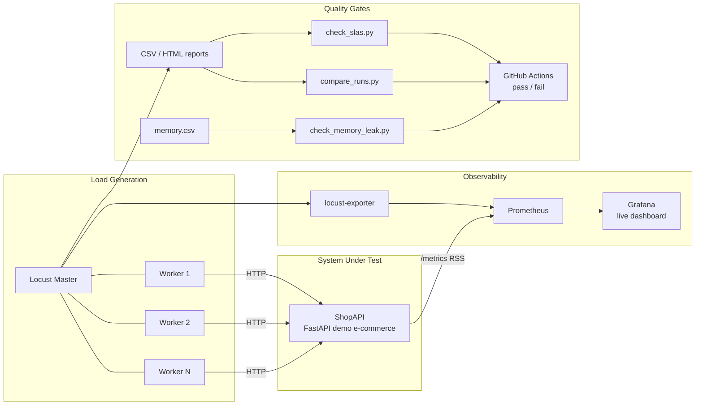

# ⚡ Locust Performance Lab

[](https://github.com/IvanPetrovic991/locust-performance-lab/actions/workflows/ci.yml)
[](https://github.com/IvanPetrovic991/locust-performance-lab/actions/workflows/nightly.yml)
[](https://locust.io)
[](docker-compose.yml)
[](LICENSE)

**Performance testing as code** — a complete, self-contained load testing framework built with
[Locust](https://locust.io). Everything runs with one command: the system under test, distributed
load generation, live Grafana monitoring, automated memory-leak hunting, run-over-run regression
detection, and an SLA gate that fails the CI build when latency budgets are breached.

> Built by a performance engineer with a JMeter background, to demonstrate the code-first,
> CI-native approach to load testing. See [Coming from JMeter?](#-coming-from-jmeter) below.


---

## Table of contents

- [Why this project](#-why-this-project)
- [Architecture](#-architecture)
- [Quickstart](#-quickstart)
- [Test scenarios](#-test-scenarios)
- [Workload model](#-workload-model)
- [Load shapes](#-load-shapes)
- [SLA gate](#-sla-gate--performance-tests-that-can-fail-the-build)
- [Regression detection](#-regression-detection)
- [Memory leak detection](#-memory-leak-detection)
- [Live monitoring](#-live-monitoring)
- [Scalability](#-scalability)
- [Testing your own system](#-testing-your-own-system)
- [CI/CD pipeline](#-cicd-pipeline)
- [Interpreting the results](#-interpreting-the-results)
- [Methodology notes & honest limitations](#-methodology-notes--honest-limitations)
- [Design decisions](#-design-decisions)
- [Coming from JMeter?](#-coming-from-jmeter)
- [Troubleshooting](#-troubleshooting)
- [Roadmap](#-roadmap)

## 🎯 Why this project

Most load testing happens too late, runs manually, and produces a PDF nobody reads. This repo
demonstrates the opposite workflow — the one modern engineering teams actually want:

1. **Tests live next to the code** and are reviewed like code.
2. **Every pull request gets a load test**, and the build fails if performance regresses.
3. **Pass/fail is decided by explicit SLAs**, not by someone eyeballing a graph.
4. **Soak-class problems (memory leaks) are detected automatically**, not discovered in production.
5. **Results are observable live** (Grafana), reported as artifacts (HTML/CSV), and comparable
   across runs.

The repo is fully self-contained: it ships its own system under test, so anyone can clone it and
see every feature working in minutes — then point it at a real system by changing one URL.

## 🏗 Architecture



| Component | Role |
|---|---|
| **Locust master + workers** | Distributed load generation; workers scale horizontally (`WORKERS=N`) |
| **ShopAPI** (`target_app/`) | Demo e-commerce API with *intentionally realistic* performance traits |
| **Prometheus + Grafana** | Live view of RPS, latency percentiles, failures, and target memory |
| **Quality-gate scripts** (`scripts/`) | Turn raw results into CI exit codes: SLAs, regressions, memory leaks |
| **GitHub Actions** | Runs the whole pipeline on every PR and nightly |

ShopAPI is deliberately not a "hello world": its search endpoint has ~15% simulated cache misses,
checkout is throttled by a small payment-gateway connection pool (latency degrades under
concurrency — a textbook queueing bottleneck), ~1% of checkouts fail with a simulated gateway
timeout, and an optional switch makes it leak memory on demand. Every test produces results worth
analyzing — not just flat green lines.

## 🚀 Quickstart

Prerequisites: Docker (with Compose v2) and `make`. Locust itself runs in a container, so nothing
needs to be installed to run a test.

The gate scripts run on the host and need `PyYAML` on any Python ≥ 3.9 — including the 3.9 that
still ships with macOS. Installing Locust locally as well (`pip install -r requirements.txt`, for
running it outside Docker or for editor completion) requires Python ≥ 3.11, which is Locust's own
floor since 2.46.

```bash
# Interactive mode: Locust web UI at http://localhost:8089
make up

# Everything + live monitoring: Grafana at http://localhost:3000
make monitoring

# Tear down
make down
```

In the web UI, pick the number of users and spawn rate, start the test, and watch the charts —
or watch the same run in Grafana with per-endpoint breakdowns and target memory.


Read the p95 column, not the average: `/search` averages 155 ms but its p95 is 740 ms — that's the
15% of requests hitting a simulated cache miss, and it is invisible in the mean. `/checkout` shows
its injected gateway failures in the `# Fails` column.

## 🧪 Test scenarios

Each headless scenario produces CSV + HTML reports in `reports/` and runs the SLA gate
automatically:

| Command | Scenario | Profile | When to use |
|---|---|---|---|
| `make smoke` | Sanity check | 10 users, 1 min | After every change to the test plan |
| `make baseline` | Reference measurement | 50 users, 5 min | Before tuning; feeds regression checks |
| `make stress` | Find the saturation point | stepped ramp 10 → 150 users | Capacity planning |
| `make spike` | Resilience to sudden traffic | 20 → **200** → 20 users | Flash sales, TV moments, failover |
| `make soak` | Degradation over time | 60 users, 30+ min (`SOAK_MINUTES`) | Leaks, connection exhaustion, drift |
| `make leak-test` | Automated memory-leak hunt | constant load + memory trend gate | Part of every soak |
| `make current` | Baseline's twin, recorded separately | 50 users, 5 min | The "after" run for `compare` |
| `make compare` | Run-over-run regression diff | two runs of the same profile | After code or tuning changes |

Every run also writes an interactive HTML report (`reports/<scenario>.html`) with charts of RPS,
latency percentiles and failures over time — the artifact you attach to a ticket.


A stepped ramp across three workers: throughput tracks the user count, p50 stays flat at ~40 ms,
and p95 does not — the tail is where saturation shows up first.

## 👥 Workload model

Traffic is modeled on real e-commerce behavior, not uniform request spam:

- **`BrowsingUser` (75%)** — browses the catalog, opens product pages, searches. Weighted tasks
  (`@task(4)` browse, `@task(3)` product page, `@task(2)` search) with think time
  (`wait_time = between(1, 3)`).
- **`PurchasingUser` (25%)** — authenticates once, then executes the full conversion funnel as a
  `SequentialTaskSet`: browse → product page → add to cart → checkout. Steps always run in order,
  like a real buyer.

Details that matter at scale:

- **Functional validation under load** — `catch_response` marks a `200` from checkout *without an
  `order_id`* as a failure, and a product payload missing its `price` field as a failure. Wrong
  answers delivered quickly are still wrong.
- **URL grouping** — dynamic URLs are grouped (`name="/products/[id]"`), so statistics aggregate
  per endpoint instead of producing 200 one-sample rows.
- **Outlier visibility** — an `events.request` listener logs every individual request slower than
  1s (`SLOW_REQUEST_MS`), so the tail is visible during the run, not only in the final percentiles.
- **Trace correlation** — authenticated users send an `X-Session-ID` header, so load test traffic
  can be tied back to the target system's logs and traces during root-cause analysis.
- **`FastHttpUser`** — both classes use the geventhttpclient-based client, which sustains roughly
  an order of magnitude more RPS per worker than the default requests-based client.

## 📈 Load shapes

`-u`/`-r`/`-t` flags cover constant load. Real questions — *where does it saturate? does it
survive a spike? does it degrade over hours?* — need load that changes over time. Profiles are
implemented as [`LoadTestShape`](locustfiles/ecommerce.py) classes and selected with one
environment variable, so one test plan serves every profile:

```python
class SpikeShape(LoadTestShape):
    """Steady 20-user baseline with a sudden 10x spike (e.g. flash sale)."""

    def tick(self):
        run_time = self.get_run_time()
        if run_time < 120:
            return (20, 5)
        if run_time < 180:
            return (200, 50)   # the spike
        if run_time < 360:
            return (20, 50)    # recovery — watch how fast p95 settles
        return None
```

| `LOAD_SHAPE` | Profile |
|---|---|
| `stages` | 10 → 50 → 100 → 150 users in steps, then ramp-down — saturation hunting |
| `spike` | 20 users baseline, sudden jump to 200, back to 20 — resilience and recovery |
| `soak` | ramp once, hold for `SOAK_MINUTES` — slow failure modes |

## ✅ SLA gate — performance tests that can fail the build

Budgets live in [`config/slas.yml`](config/slas.yml) — global plus per-endpoint overrides:

```yaml
global:
  p95_ms: 800          # 95th percentile latency budget
  error_rate_pct: 2.0
  min_rps: 3           # sanity floor — the test must have generated real load
endpoints:
  "POST /checkout":
    p95_ms: 1500       # payment gateway call is allowed a higher budget
    error_rate_pct: 5.0  # ~1% failures injected by design + binomial headroom
  "GET /search?q=[term]":
    p95_ms: 1000       # known cache-miss penalty
```

[`scripts/check_slas.py`](scripts/check_slas.py) parses Locust's CSV output, prints a verdict
table, and **exits non-zero on any breach**. An endpoint that has an SLA but produced no results
row is also a failure — a typo in the config must not silently disable a gate. Real output from
a run of this repo:

| Scope | Metric | Actual | Limit | Verdict |
|---|---|---|---|---|
| POST /checkout | p95 latency | 350 ms | <= 1500 ms | ✅ PASS |
| POST /checkout | error rate | 0.00 % | <= 5.0 % | ✅ PASS |
| GET /search?q=[term] | p95 latency | 750 ms | <= 1000 ms | ✅ PASS |
| Aggregated | p95 latency | 220 ms | <= 800 ms | ✅ PASS |
| Aggregated | error rate | 0.00 % | <= 2.0 % | ✅ PASS |
| Aggregated | throughput | 9.0 rps | >= 3 rps | ✅ PASS |

Locust itself runs with `--exit-code-on-error 0` everywhere in this repo: the demo API injects
~1% payment failures *by design*, so "any failed request = exit 1" (Locust's default) would abort
every pipeline before its gate ran. Failures are budgeted in the SLAs, not treated as fatal —
the gate script is the only judge.

Why a script instead of a dashboard? Because a dashboard needs a human, and a human is exactly
what a nightly pipeline doesn't have. An exit code scales.

## 📉 Regression detection

A single run tells you *where you are*; comparing runs tells you *where you're heading*.
[`scripts/compare_runs.py`](scripts/compare_runs.py) diffs two runs **of the same load profile**
endpoint by endpoint and fails when p95 grows or throughput drops beyond a tolerance (default
15%), or the error rate worsens by more than 0.5 percentage points (`--error-rate-tolerance-pp`):

```bash
make baseline     # record the reference run (50 users, 5 min)
# ...change code, tune a pool size, upgrade a dependency...
make current      # the identical profile, recorded separately
make compare
```

Real output (60-second demo runs, hence the small per-endpoint samples):

| Endpoint | p95 (base → now) | Δ p95 | rps (base → now) | Δ rps | errors (base → now) | Verdict |
|---|---|---|---|---|---|---|
| GET /products/[id] | 64 → 70 ms | +9.4 % | 2.8 → 2.7 | -5.0 % | 0.00 → 0.00 % | ✅ OK |
| GET /products?page=[n] | 46 → 47 ms | +2.2 % | 3.8 → 3.8 | +2.0 % | 0.00 → 0.00 % | ✅ OK |
| GET /search?q=[term] | 790 → 750 ms | -5.1 % | 1.7 → 1.7 | +1.8 % | 0.00 → 0.00 % | ✅ OK |
| POST /auth/login | 130 → 160 ms | +23.1 % | 0.1 → 0.1 | -0.2 % | 0.00 → 0.00 % | ⚪ LOW SAMPLE |
| POST /checkout | 340 → 350 ms | +2.9 % | 0.3 → 0.3 | -5.2 % | 5.00 → 0.00 % | ⚪ LOW SAMPLE |
| Aggregated | 310 → 220 ms | -29.0 % | 9.0 → 9.0 | -0.4 % | 0.19 → 0.00 % | ✅ OK |

Note the `LOW SAMPLE` verdicts: endpoints with fewer than `--min-requests` (default 20) samples
in either run are reported but **not gated** — a ±30% p95 swing computed from 8 requests is
quantization noise, not evidence. Comparing runs of *different* profiles (say, a 50-user baseline
against a 10-user smoke) is refused the same way in spirit: it's meaningless by construction, so
`make compare` defaults to the twin `baseline`/`current` targets.

### Why the baseline is a median, not a run

One run is one sample of a noisy process, and a gate built on a single sample is a coin flip. This
repo learned that the hard way: the nightly job originally compared each run against *the last
nightly that passed*, which sounds sensible and is actually a ratchet. A passing run is by
definition a fast one, so the baseline creeps towards the fastest night ever recorded, and every
ordinary night afterwards reads as a regression — until one lucky-fast run resets it and the cycle
repeats. The failure pattern in the Actions history is unmistakable in hindsight: a green run,
then a streak of red, then another green.

The fix is in the statistics, not the tolerance. `compare_runs.py` accepts **any number of
baseline runs** and reduces them to a per-endpoint median:

```bash
python scripts/compare_runs.py baselines/*/ci_stats.csv reports/ci_stats.csv
```

A median tracks the environment instead of chasing its best case, and it cannot ratchet. Runs that
never exercised an endpoint are excluded from that endpoint's median rather than dragging it
toward zero, and request counts are merged with `min()` so the low-sample guard stays pessimistic.
The nightly job feeds it the last five nightlies **regardless of whether they passed** — selecting
on the outcome is what created the bias in the first place.

Endpoints that appear in only one side of the comparison are surfaced rather than skipped:
`🆕 NEW (no baseline)` for a freshly added task, `⚪ GONE` for one that stopped firing — a renamed
task that silently drops its history is a real way to lose a regression signal.

## 🧠 Memory leak detection

Soak tests exist to catch what a 5-minute run never will: memory that grows linearly under
constant load until the service OOMs in production. This repo automates the whole hunt:

```bash
make leak-test                  # sample memory under 10 min of constant load + analyze
make leak-test LEAK_MINUTES=60  # the real thing, alongside `make soak`
```

[`scripts/memory_monitor.py`](scripts/memory_monitor.py) samples the target container's memory
every 5s while the load runs; [`scripts/check_memory_leak.py`](scripts/check_memory_leak.py)
discards the warm-up phase (caches filling up is growth, not a leak), fits a least-squares trend
line through the rest, and **fails when the growth rate and total growth both exceed their
budgets** — two conditions, so noise from short runs can't extrapolate into a false alarm.

Don't trust a leak detector you've never seen catch a leak. ShopAPI ships with a simulated leak
(~50 KB per request, `SIMULATE_MEMORY_LEAK=true`) so the gate can be demonstrated end to end.
Real output from both runs of this repo, same load, three minutes each:

```bash
SIMULATE_MEMORY_LEAK=true make leak-test LEAK_MINUTES=3
```

| Metric | Value |
|---|---|
| analyzed window | 2.4 min (23 samples, warm-up excluded) |
| memory at window start → end | 58.2 MB → 153.7 MB |
| total growth | **+95.5 MB** (gate: > 15 MB) |
| fitted growth rate | **+2351 MB/h** (gate: > 50 MB/h) |
| verdict | ❌ **MEMORY LEAK SUSPECTED** — exit 1 |

```bash
make leak-test LEAK_MINUTES=3
```

| Metric | Value |
|---|---|
| total growth | +2.5 MB (gate: > 15 MB) |
| fitted growth rate | +59.5 MB/h — slightly over the rate gate, but extrapolated from noise |
| verdict | ✅ **STABLE** — exit 0, because *both* conditions must hold |

Two complementary vantage points are used: the gate measures **black-box** memory via
`docker stats` (no instrumentation needed — but note its "usage" figure includes the page cache,
so a service that writes files a lot needs the white-box view instead), while ShopAPI also
exposes its own RSS on a Prometheus `/metrics` endpoint — the **white-box** curve is visible
live in Grafana while the soak is still running.

## 📊 Live monitoring

`make monitoring` adds the observability stack: an exporter turns the Locust master's live stats
into Prometheus metrics, ShopAPI exposes its own process metrics, and a pre-provisioned Grafana
dashboard (`http://localhost:3000`, no login needed) shows:

- active users, current RPS, failures/s, total requests (top row)
- per-endpoint throughput and **p95 response time**
- p50/p95 overlaid with the user ramp — see latency react to load
- target memory usage — the leak-hunting panel

This is the same setup you'd use to watch a production load test: no waiting for the final
report, problems are visible the moment they start.

A dashboard is also evidence, so it can be exported without a human at a keyboard:

```bash
make dashboard-png                          # -> reports/dashboard.png
make dashboard-png DASHBOARD_MINUTES=60     # a longer window, e.g. after a soak
```

Grafana renders it server-side, so this works over SSH and in CI — attach the PNG to the ticket
next to the CSV. The screenshots in this README are produced by that target.

### A dashboard that reads zero is worse than no dashboard

[`monitoring/locust_exporter.py`](monitoring/locust_exporter.py) is ~70 lines of stdlib Python
rather than an off-the-shelf image, and the reason is worth stating because it is the kind of
thing load-test dashboards get wrong quietly.

The usual choice, `containersol/locust_exporter`, reads a flat `current_response_time_percentile_95`
key from the master's JSON. Locust does not publish that key — current percentiles arrive nested,
as `{"current_response_time_percentiles": {"response_time_percentile_0.95": 89}}`. Go's JSON
decoder leaves an absent field at its zero value, so **the percentile gauges publish `0` forever**
and a latency dashboard shows a flat, reassuring line. Verified against a live master on both
v0.5.0 and v0.5.2, and the upstream project's last commit was in 2023. It is also published for
`linux/amd64` only, so it runs under emulation on any recent Mac.

Percentiles are the entire point of a latency dashboard, so the exporter was replaced instead of
worked around. The replacement also exposes the distinction Locust makes and most dashboards blur:

| Metric | Window | Use it for |
|---|---|---|
| `locust_requests_p95_response_time{name,method}` | cumulative since test start, per endpoint | SLA verdicts — matches the `95%` column of the CSV report |
| `locust_requests_current_p95_response_time` | 10-second sliding window, whole test | plotting against a user ramp — it rises and decays with load |

Charting the cumulative value against a ramp produces a curve that flattens as the run goes on no
matter what the system does. That graph looks calm and means nothing.

## 📐 Scalability

Load generation scales horizontally without touching the test plan:

```bash
make up WORKERS=8        # 8 Locust worker containers on this host
```

- **`FastHttpUser`** keeps per-worker overhead low — a single generator can sustain thousands
  of RPS. (The screenshots above show ~35 RPS not because the generator is limited, but because
  80 simulated users with 1–3 s think time *produce* ~35 req/s — the workload models human
  behavior, it doesn't race the CPU.)
- The master/worker split is plain Docker Compose, so the same images run distributed across
  multiple hosts by pointing `--master-host` at the master. A Kubernetes/Helm setup is on the
  [roadmap](#-roadmap) — the containers themselves are ready for it.
- Test scenarios, SLAs, and infrastructure are decoupled (`locustfiles/`, `config/`,
  `docker-compose.yml`) — each scales or swaps independently.

## 🔌 Testing your own system

The demo API is a stand-in. To target a real system:

1. Point the host at it: `locust -f locustfiles/ecommerce.py --host https://staging.example.com`,
   or change `--host` in the `Makefile`/`docker-compose.yml`.
2. Replace the task methods in [`locustfiles/ecommerce.py`](locustfiles/ecommerce.py) with your
   endpoints — the structure (user classes, weights, funnel, validation) carries over as-is.
3. Update [`config/slas.yml`](config/slas.yml) with your latency budgets.
4. For `make leak-test`, set the container name of *your* service in the `--container` flag.

Everything else — distributed workers, shapes, gates, CI, dashboards — works unchanged.

## 🔄 CI/CD pipeline

Two workflows, split along a deliberate line: **a check whose verdict is deterministic can gate a
merge and carry a badge; a check that compares noisy samples cannot.**

[`.github/workflows/ci.yml`](.github/workflows/ci.yml) — on `push` to `main`, every
`pull_request`, and on demand:

| Job | What it does |
|---|---|
| `lint` | `ruff check` over the whole repo |
| `gate-tests` | `pytest` over [tests/](tests/) — the scripts that decide pass/fail deserve tests more than anything else in the repo |
| `load-test` | build and health-check the target → run Locust headless → **SLA gate** |

The SLA gate judges against the absolute budgets in `config/slas.yml`, not against another run, so
its verdict does not depend on how busy the runner was. That is what makes it safe to block a
merge on. Locust runs with `--exit-code-on-error 0` (the gate is the judge, not Locust's default
any-failure exit), and the verdict table lands in the GitHub job summary.

[`.github/workflows/nightly.yml`](.github/workflows/nightly.yml) — the checks that need history or
time:

| Job | What it does |
|---|---|
| `trend` | 5-minute run → SLA gate → **regression gate against the median of the last five nightlies** (any conclusion — see [why](#why-the-baseline-is-a-median-not-a-run)) |
| `memory-leak` | soak-lite run through the leak gate, then a **self-test that proves the gate still fires** on a deliberately leaking build |

The nightly's tolerances are deliberately wider than the local defaults (p95 +35%, throughput
−25%). A hosted runner is shared hardware; the median baseline removes the noise from the
*reference*, but the run being judged is still a single sample. The gate is calibrated to catch a
doubling or an error spike, not to resolve a few percent — claiming otherwise would just be a
flaky gate with a confident name.

The leak self-test is the part worth stealing. `ShopAPI` can be told to leak on demand, so the
nightly runs the detector against a leaking build and **fails if the detector stays quiet**. A
gate nobody has watched catch anything is a gate nobody should trust, including its author.

> **Note on the schedule.** GitHub disables `schedule` triggers in public repositories after 60
> days without repository activity, and re-enabling is manual:
> `gh workflow enable nightly.yml`. This is documented rather than worked around — the usual
> workaround is a bot committing noise to keep a timer alive, which trades an honest gap in the
> history for a dishonest one.

## 🔍 Interpreting the results

A few principles this repo's design encodes, which apply to any load test:

- **Percentiles over averages.** ShopAPI's search averages ~140 ms but its p95 is ~780 ms — the
  average hides the 15% of users hitting cache misses. SLAs here are written against p95.
- **Watch latency *as a function of* load.** The Grafana percentile panel overlays the user ramp:
  if p95 climbs while RPS plateaus during `make stress`, you've found the saturation point —
  that plateau is your capacity number.
- **Errors are a latency metric too.** A system that sheds load with fast 502s looks *faster* in
  averages. The SLA gate therefore budgets error rate separately.
- **Trends beat snapshots.** A 300 ms p95 is neither good nor bad in isolation; +44% versus
  yesterday's baseline is actionable. Hence `compare_runs.py` and the nightly run.
- **Memory verdicts need both slope and magnitude.** Short windows extrapolate noise (41 MB/h
  from a 3-minute stable run); requiring absolute growth *and* rate keeps the leak gate honest.

## ⚖️ Methodology notes & honest limitations

Every load test encodes assumptions; these are this repo's, stated up front — knowing your
tool's blind spots is part of the craft:

- **Closed workload model.** Users here wait for a response, think, then act — like humans on a
  webshop. The flip side is *coordinated omission*: when the server slows down, a closed model
  generates less load, so percentiles read optimistic compared to an open (arrival-rate) model.
  For queue-buildup scenarios (payment pools, flash sales), an open-model scenario using
  `constant_throughput` pacing is the right cross-check — it's on the roadmap.
- **Generator and target share a machine** in the local and CI setups. That is fine for
  demonstrating the framework and catching regressions, but a *capacity* number you'd defend
  (e.g. from `make stress`) needs the generator on separate hardware — otherwise you might be
  measuring the generator's saturation, not the API's.
- **One run = one sample.** The SLA gate judges a single run against absolute budgets with
  deliberate headroom (that's what the 5% checkout error budget is), which is legitimate because
  the budget doesn't move. Comparing two runs is a different problem: there the noise is on both
  sides, which is why the nightly compares against a median of recent history rather than against
  one previous run, and why its tolerances are wider than the local defaults. The run being judged
  is still a single sample — for a decision that needs to resolve a few percent, repeat the run
  and compare medians on both sides.
- **Locust percentiles are bucketed approximations** (coarser at higher values), which is why
  the `LOW SAMPLE` guard exists and why budgets are not set within one bucket of the observed
  values.
- **Absolute millisecond budgets are environment-specific.** The values in `config/slas.yml` are
  calibrated for GitHub's runners and this demo API; point the suite at your own system and the
  first thing to do is re-baseline them.

## 🧩 Design decisions

| Decision | Rationale |
|---|---|
| Ship a demo SUT with deliberate bottlenecks | A framework demo against a perfect target proves nothing; every feature here is demonstrable against a system that actually misbehaves |
| Gates as small stdlib-ish scripts, not plugins | Exit codes compose with any CI; no plugin lock-in; reviewable in one screen |
| `LOAD_SHAPE` env var, one locustfile | One reviewed workload model reused across smoke/stress/spike/soak — profiles differ, behavior doesn't |
| Leak gate = slope **and** absolute growth | Either alone produces false alarms on short runs or misses slow leaks |
| Compose profiles for monitoring | `make up` stays light; the full observability stack is one flag away |
| `FastHttpUser` by default | Load generators should saturate the target, not themselves |
| Median baseline, not "the last green run" | Selecting the baseline on its outcome ratchets it towards the fastest run ever recorded |
| A 70-line exporter instead of a dependency | The off-the-shelf one reports `0` for every percentile; on a latency dashboard that is worse than no dashboard |
| Wider tolerances in CI than locally | Shared runners are noisy hardware; a gate tuned tighter than the environment's own variance is just a flaky gate |
| Dependabot on pips, images and actions | A load test running last year's client is testing last year's behaviour — and every bump gets load-tested before merge |

## 🔄 Coming from JMeter?

I run JMeter in production projects daily — this lab demonstrates what the code-first approach
adds:

| Concern | JMeter | Locust (this repo) |
|---|---|---|
| Test plan | XML `.jmx`, GUI-edited, hard to diff | Plain Python — reviewable in a PR |
| Complex user logic | Chained pre/post-processors | Ordinary code (`SequentialTaskSet`) |
| Load profiles | Plugins (Ultimate Thread Group) | ~15 lines of `LoadTestShape` |
| Scale-out | Manual master/slave RMI setup | `docker compose` worker replicas |
| CI integration | Possible, heavyweight | Native: pip install + exit codes |
| Pass/fail criteria | Assertions + external tooling | SLA/regression/leak gates with exit codes |

Both have their place — JMeter's protocol coverage and ecosystem are unmatched. The skill is
choosing the right tool and making either one a first-class citizen of the delivery pipeline.

## 📂 Project structure

```
├── locustfiles/ecommerce.py     # user journeys + stress/spike/soak load shapes
├── target_app/                  # ShopAPI — FastAPI system under test (Docker)
├── config/slas.yml              # latency / error-rate / throughput budgets
├── scripts/check_slas.py        # SLA gate (CI exit code + Markdown summary)
├── scripts/compare_runs.py      # regression detection over a median baseline
├── scripts/memory_monitor.py    # container memory sampler (docker stats -> CSV)
├── scripts/check_memory_leak.py # memory-leak gate (trend analysis on soak runs)
├── tests/                       # unit tests for the gate scripts (pytest)
├── monitoring/locust_exporter.py# Locust -> Prometheus, percentiles included
├── monitoring/                  # Prometheus + Grafana provisioning (dashboard as code)
├── .github/workflows/ci.yml     # lint + gate tests + load test on every push/PR
├── .github/workflows/nightly.yml# trend comparison + memory-leak gate
├── .github/dependabot.yml       # weekly pin refresh, load-tested before merge
├── docker-compose.yml           # SUT + distributed Locust + monitoring/report profiles
├── pyproject.toml               # ruff + pytest configuration
├── docs/images/                 # screenshots used in this README
└── Makefile                     # one-command scenarios
```

## 🛠 Troubleshooting

| Symptom | Fix |
|---|---|
| `make up` fails: ports 8000/8089/3000 busy | Stop whatever holds them or change the port mappings in `docker-compose.yml` |
| Workers don't connect | `docker compose logs locust-master` — workers retry automatically; check they share the compose network |
| `check_slas.py`: `ModuleNotFoundError: yaml` | `pip install -r requirements.txt` |
| Leak gate says `only N samples` | Run longer (`LEAK_MINUTES`) — the trend fit needs at least 10 samples |
| Grafana panels empty | Start a test first; the exporter only has data while Locust is running |
| `pip install -r requirements.txt` fails on Python 3.9/3.10 | Locust requires 3.11+. The gate scripts don't — they only need `pip install PyYAML` |
| Nightly stopped running by itself | GitHub disables cron in public repos after 60 days of inactivity: `gh workflow enable nightly.yml` |

## 🗺 Roadmap

- [x] Nightly runs auto-compare against recent history (median of the last five)
- [x] Memory-leak gate runs in CI, including a self-test that proves it still fires
- [x] Real percentiles on the live dashboard
- [ ] Open-workload-model scenario (`constant_throughput`) as a coordinated-omission cross-check
- [ ] OpenTelemetry: Locust 2.42+ ships `--otel`, and ShopAPI spans correlated via `X-Session-ID`
      would close the loop from load generator to server-side trace
- [ ] `MarkovTaskSet` (Locust 2.38+) — probabilistic user journeys instead of a fixed funnel
- [ ] k6 implementation of the same scenarios — tool-agnostic comparison
- [ ] Kubernetes manifests / Helm chart for cloud-scale load generation

## 🧰 Tech stack

Locust 2.46 · Python 3.12 · FastAPI · Docker Compose · Prometheus 3 · Grafana 12 · GitHub Actions ·
pytest · ruff

## 👤 Author

**Ivan Petrovic** — performance engineer (JMeter in production by day; this lab is the
code-first counterpart). GitHub: [@IvanPetrovic991](https://github.com/IvanPetrovic991).
If you're hiring for performance engineering or want to talk shop, reach out on LinkedIn.

## 📄 License

[MIT](LICENSE)
